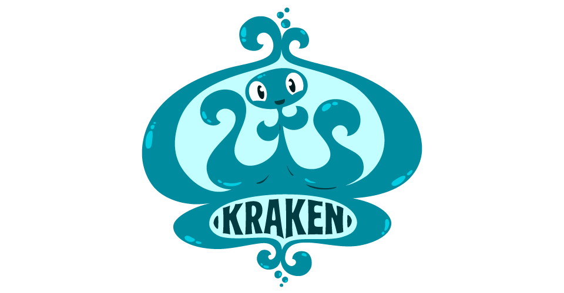

# Kraken

[](https://travis-ci.org/sabirvirtuoso/Kraken)
[](http://cocoapods.org/pods/Kraken)
[](http://cocoapods.org/pods/Kraken)
[](http://cocoapods.org/pods/Kraken)


_Photo courtesy of [www.krakenstudios.blogspot.com](http://krakenstudios.blogspot.com/)_

## Introduction

`Kraken` is a simple **Dependency Injection Container**.

It's aimed to be as simple as possible yet provide rich functionality usual for DI containers on other platforms. It's inspired by [Dip](https://github.com/AliSoftware/Dip) and some other DI containers.

* You start by creating a `Dependency Configurator` for bootstrapping and **registering your dependencies, by associating a _protocol_ or _type_ to either an `implementation type`, an `implementation` or a `factory`**. It is preferrable to call your `Dependency Configurator` from `main.swift`.
* Then you can call `Kraken.inject(typeToInject)` to **resolve an instance of _protocol_ or _type_** based on the bootstrapping in your `Dependency Configurator`.

## Documentation

`Kraken` is yet to be documented fully but it comes with a sample project that lets you try all its features and become familiar with the API. You can find it in `Trigger.xcworkspace`.

File an issue if you have any question.

To run the example project, clone the repo, and run `pod install` from the Example directory first.

## Features

- **`Scopes`**. Kraken supports 3 different scopes (or life cycle strategies): _Prototype_, _Singleton_, _EagerSingleton_;
- **`Named definitions`**. You can register an `implementation type`, an `implementation` or a `factory` for a protocol or type;
- **`Runtime arguments`**. You can register factories that accept up to 3 runtime arguments (You can create an extension to increase number of runtime arguments);
- **`Circular dependencies`**. Kraken can resolve circular dependencies;
- **`Auto-wiring`**. Kraken can infer your components' dependencies injected in constructor and automatically resolve them.
- **Easy configuration**. No complex container hierarchy, no unneeded functionality;
- **Thread safety**. Registering and resolving components is thread safe;
- **Helpful error messages**. If something can not be resolved at runtime Dip throws an error that completely describes the issue;

## Basic usage

Create a Dependency Configurator file where you bootstrap your dependencies much like the example shown below:

```swift
import Kraken

class DependencyConfigurator {

  static func bootstrapDependencies() {

    // Register a protocol or type by providing its implementation type
    Kraken.register(ServiceA.self, implementationType: ServiceAImpl.self, scope: .Singleton)

    // Register a protocol or type by providing its implementation
    Kraken.register(ServiceC.self, implementation: dummyImplementation, scope: .Singleton)

    // Register a protocol or type having weak property to allow Kraken to handle circular dependencies
    Kraken.register(ServiceB.self, implementationType: ServiceBImpl.self, scope: .Singleton) {
      (resolvedInstance: Injectable) -> () in

      let serviceB = resolvedInstance as! ServiceBImpl
      serviceB.serviceA = Kraken.injectWeak(ServiceA).value as! ServiceAImpl
    }

    // Register a protocol or type having runtime arguments to be injected in constructor
    Kraken.register(ServiceD.self) {
      ServiceDImpl(host: $0, port: $1, serviceB: Kraken.inject(ServiceB) as! ServiceBImpl) as ServiceD
    }

    // Register generic protocols or types
    Kraken.register(GenericDataSource<ServiceAImpl>.self, implementationType: ServiceAImplDataSource.self, scope: .EagerSingleton)

    // Register a protocol or type whose components' dependencies are injected automatically by container
    Kraken.register(ServiceE.self) {
      ServiceEImpl(serviceA: $0, serviceB: $1, serviceC: $2)
    }
  }
}

```

It is worth mentioning that the protocols or types which are registered must conform to the `Injectable` protocol in order to be resolved by the container as shown in the example below:

```swift
import Kraken

protocol ServiceA: Injectable {
  func myCompanyA() -> String
}

```

After bootstrapping dependencies, its injection is as simple as invoking `Kraken.inject()` which can be of different types as shown below:

```swift
import Kraken

// Inject dependency whose implementation was registered
let serviceC: ServiceC = Kraken.inject(ServiceC)

// Inject dependency whose implementation type was registered
let serviceA: ServiceA = Kraken.inject(ServiceA)

// Inject dependency providing runtime arguments
let serviceD: ServiceD = Kraken.inject(ServiceD.self, withArguments: "localhost", 8080)

// Inject dependency which is resolved by container through AutoWiring
let serviceE: ServiceE = Kraken.inject(ServiceE)

```

## Installation

Kraken is built with Swift 2.2.

Kraken is available through [CocoaPods](http://cocoapods.org). To install
it, simply add the following line to your Podfile:

```ruby
pod 'Kraken', '1.1.2'
```

## Author

Syed Sabir Salman-Al-Musawi, sabirvirtuoso@gmail.com

I'd also like to thank [**Sharafat Ibn Mollah Mosharraf**](https://www.facebook.com/sharafat.8271) for his big support during the development phase.

**Kraken** is available under the **MIT license**. See the `LICENSE` file for more info.

The GIF at the top of this `README.md` is from [www.krakenstudios.blogspot.com](http://krakenstudios.blogspot.com/)
